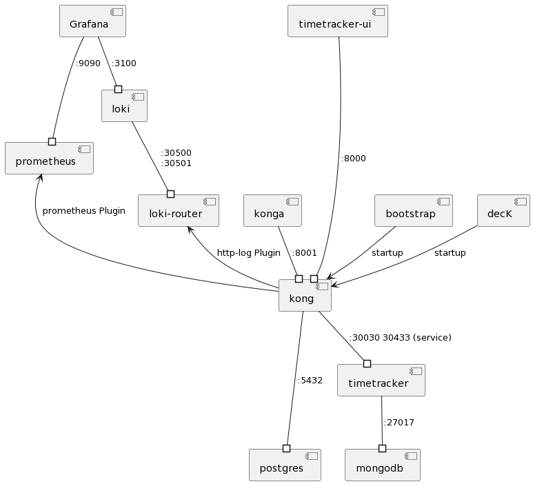

# kong
## Dependencies



## PlantUML code
```

@startuml

top to bottom direction


[Grafana]          --# [prometheus]       : :9090
[Grafana]          --# [loki]             : :3100
[loki]             --# [loki-router]      : :30500\n:30501
[loki-router]      <-- [kong]             : http-log Plugin
[konga]            --# [kong]             : :8001
[prometheus]       <-- [kong]             : prometheus Plugin
[kong]            ---# [postgres]         : :5432

[timetracker-ui] ----# [kong]             : :8000
[kong]             --# [timetracker]      : :30030 30433 (service)
[timetracker]      --# [mongodb]          : :27017

[bootstrap]        --> [kong]             : startup
[decK]             --> [kong]             : startup

@enduml

```
[-- Link --](https://www.planttext.com/?text=VP8nRyCW48Nt-nL8NTe12OT4QQogojQXItUN0TlKGROvXC_z_QLEazZ83GiIVE_UkzF1SI0TQEmx04BF25c9HDYpsWPJaKK70CLRq5_QQSNEX_C7LlY0lQ6J6OVBSyxoWpY8TRp3rbuUhhZCHCIJholE0uvaWhhXOYV4fvlk35BcXNDMjEYQrEP4v7c73VleniOwc22jbePhmlnP_FeadVxhS-CMJcbh7WTgWXdKt6ctbPiuQBAnGj1LQm8VhRgRJAoNdvMOJqv8mQJOIiaU1nE-RMMU86KdVHzhObsgXTrcBx9zp5SYqX0LNlqPlgxdEs-LPr3KfdfVHBol03WQLyTz_040)